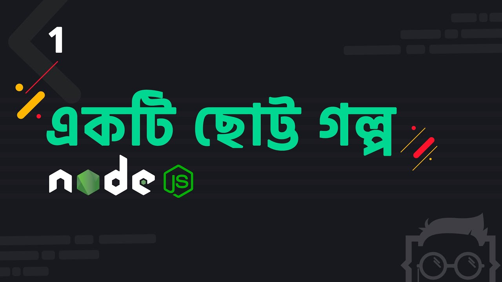
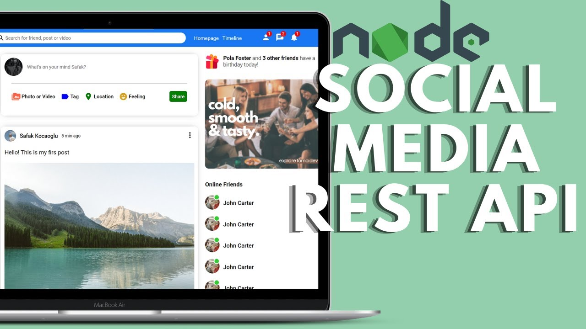

# Learn Node From YouTube
Learning Node Js From YouTube Tutorial

## [Node.js || Express.js Tutorial Bangla](https://github.com/Mdromi/Learn-Node-From-YouTube/tree/main/NodeExpress-tutorial-LWS)

- [Core Nodejs](https://github.com/Mdromi/Learn-Node-From-YouTube/tree/main/NodeExpress-tutorial-LWS/Core-Nodejs-With-LWS)
- [Raw Node Project](https://github.com/Mdromi/Learn-Node-From-YouTube/tree/main/NodeExpress-tutorial-LWS/Raw-Node-Project)
- [ExpressJs](https://github.com/Mdromi/Learn-Node-From-YouTube/tree/main/NodeExpress-tutorial-LWS/ExpressJs-LWS)
- [Chat Application](https://github.com/Mdromi/MERN-Tutorial-Project/tree/main/chat-application-lws)

    

## [Node.js Social Media REST API with MongoDb](https://github.com/Mdromi/Learn-Node-From-YouTube/tree/main/Node.js%20Social%20Media%20REST%20API%20with%20MongoDb)
__Table of Content__
- Setup Project
- User Login Register System
- User Follow Unfollow System
- Post CURD Operation
- Like Dislike System

    

